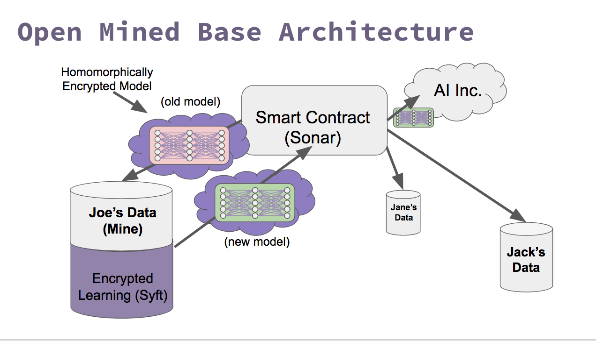

OpenMined Unity Application
=============================================

[](https://travis-ci.org/OpenMined/OpenMined)
[](https://opensource.org/licenses/Apache-2.0)


Table of Contents:   

 * [Introduction](#introduction)
 * [Quick Setup](#quick-setup)
 * [General Troubleshooting](#general-troubleshooting)
 * [Links and HowTos](#links-and-how-tos)
 * [References](#references)

## Introduction

OpenMined Unity Application applies the [PySyft](https://github.com/OpenMined/PySyft) library into a Unity Application. Please see the PySyft repository README.md for more details on the intent of OpenMined and to familiarize yourself more with the basic concepts of the project.

Also check out the [Docs](https://github.com/OpenMined/Docs) for more information! We are working toward consolidating all the documentation to make it easier for new contributors.

**Why Unity?**

Unity has a few advantages that we are leveraging for this project

1. It's portable.
2. It's free
3. It has versitile GPU access.  
4. It can be used for high end graphics gaming consoles (Playstation, XBox, etc)

More about this in the [corresponding file](https://github.com/OpenMined/OpenMined/blob/master/tutorials/WhyUnity.md) at tutorials folder

**Marketplace Mechanics**  
`TODO`

### Architecture



## Quick Setup

1. Install Unity:
    - Windows & Mac users: Download it from [here](https://store.unity.com/).
    - Linux users: Download it from [here](http://beta.unity3d.com/download/ee86734cf592/public_download.html)

Note: If you do not already have one, you will have to create a Unity account when you open the Application for the first time. For new users, a Personal account should be ok.

2. Open project in Unity `[File -> Open Project -> Directory/To/OpenMined`]

3. Open Juptyer Notebooks in the `notebooks` directory.  

## Setup Troubleshooting

If you have an issue, refer to the following steps for a more detailed project setup. These steps were confirmed to work under a Windows/linux enviornment, though the steps should be applicable to alternative operating systems.

The steps come in two parts:   
**Part 1:** Unity Setup   
**Part 2:** Jupyter Setup

**Unity Setup**  

1. Download Unity from [here](https://store.unity.com/) or [here](http://beta.unity3d.com/download/ee86734cf592/public_download.html)(linux)  
2. Open project in Unity `[Open(Top Right of Home Screen) -> Directory/To/OpenMined`]
3. In the Project Pane (usually below), double click OpenMinedMain. If you can't find the file for some reason, check the trouble shooting section.
4. Hit `Play` on the Unity Editor

**Jupyter Setup**

1. Run `jupyter notebook` from you openmined directory
2. Open [Syft Tensor Example Notebook.ipynb](https://github.com/OpenMined/OpenMined/blob/master/notebooks/Syft%20Tensor%20Example%20Notebook.ipynb)
3. Run the notebook

### For OSX (High Sierra)

Same steps as above. Download Unity from [here](https://store.unity.com/). I chose the personal version. This will provide you a .dmg installer, which will download and install the necessary components (~800mb).

**If on OSX turn on Metal Support**  
*NOTE: Unity does not provide metal support for MacOS 10.12.2 and 10.12.3. Please upgrade your OS before using Unity.*

- Within Unity editor select: `Edit -> Project Settings -> Player`
    - In the Inspector, scroll down until you find `Metal Editor Support` under `Other Settings` and click the checkbox to turn it on. (skip this if not on Mac OSX)
    - In the Inspector, expand `Resolution` and check the box for `Run in Background`

## General Troubleshooting

1) *If OpenMinedMain is missing*
- On the right menu: Check `Main Camera` object has `SyftServer.cs` component attached to it
- On the bottom dialog: Go to `OpenMined/Network/Servers` drag `SyftServer.cs` to `Main Camera` object
- Add a `Compute Shader` to the `Shader` variable of `SyftServer.cs` script
- Go to `OpenMined/Syft/Math/Shaders` drag `FloatTensorShaders` to `SyftServer (Script)` component recently attached to `Main Camera`

2) *If my applications do not seem to be communicating between eachother...*

**Check if the Server is running...**
___
It should run on port 5555 and this can be checked by running the following command on CMD with administrator permissions.  
```
netstat -a -b | findstr :5555  
```
If just the Server is running, the output should be:  
```
TCP    0.0.0.0:5555           YOUR_PC_NAME:0      LISTENING
```
If both Server and Jupyter Notebook are running and communicating, the output should be:  

```
TCP    0.0.0.0:5555           YOUR_PC_NAME:0      LISTENING
TCP    127.0.0.1:5555         YOUR_PC_NAME:63956  ESTABLISHED
TCP    127.0.0.1:63956        YOUR_PC_NAME:5555   ESTABLISHED
```
Another way:   
**Osx/Linux**  

```  
lsof -i :5555
```
Result should be:   

```  
Unity   1709 user   38u  IPv4 0x59e297c6d0d734e31      0t0  TCP *:personal-agent (LISTEN)
```
---

3) *My application randomly stops working.*   

**Jupyter Notebook only works if Unity has focus**  
	By default, the "Run in background" options is disabled. So if the Unity Editor loses focus then the Jupyter Notebook won't work.
Go to Edit -> Project Settings -> Player. The inspector pane will now change to show the player settings. Look for the option that says "Run In Background" and check it [1]


## Links and How Tos

##### How Tos:
---
[How to add a Function to Float Tensor](https://docs.google.com/document/d/1WRd7gGLFN0Awtf86AICYIHtg3gfFWLBa5wYTthsB3i0/edit?usp=sharing)

##### Video Links:
---
[Introduction](https://www.youtube.com/watch?v=sXFmKquiVnk)  
[Architecture Proposal](https://www.youtube.com/watch?v=47enlQQcMQc)  

## References

[1] [stop unity pausing when it loses focus](https://answers.unity.com/questions/42509/stop-unity-pausing-when-it-loses-focus.html)
