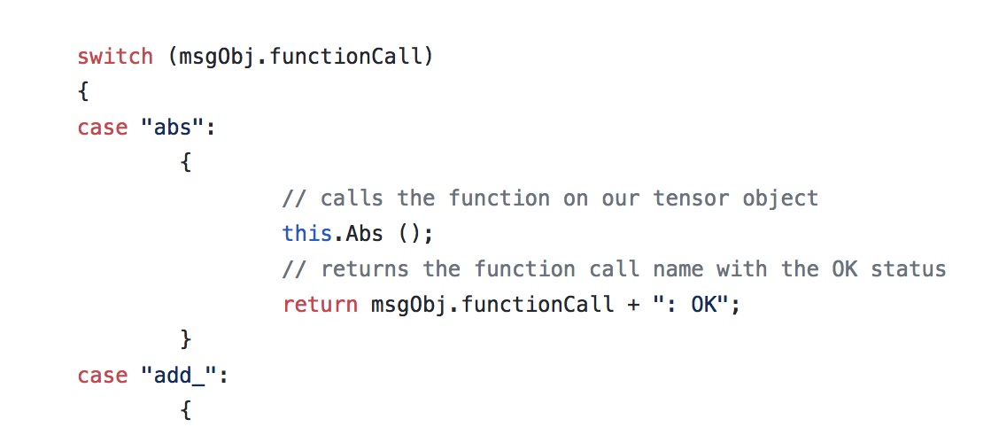
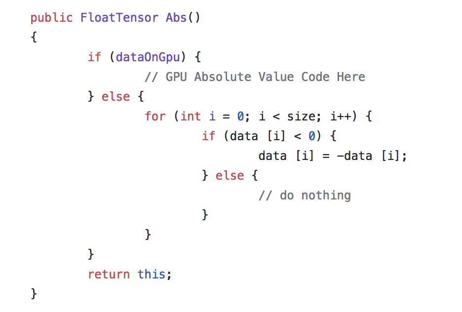
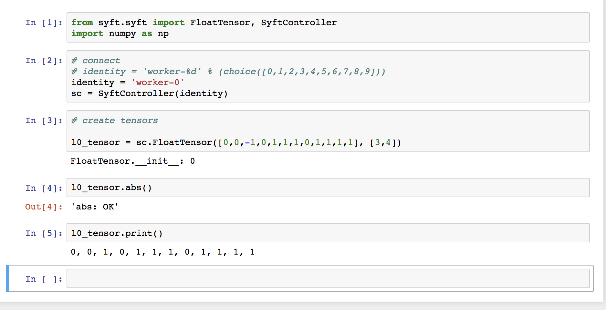
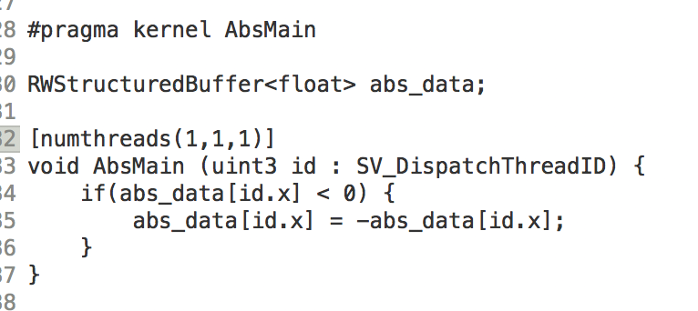
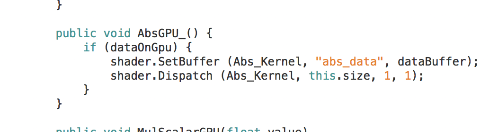
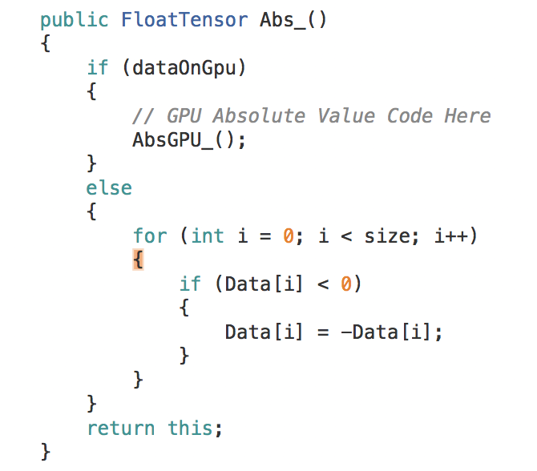

# How to Add A Function to FloatTensor

## Step 1: Walk through Readme (install stuff)

- Readme: https://github.com/OpenMined/OpenMined
- **If on Mac OSX - Turn on Metal Support**

## Step 2: Turn on Metal and Background Process
- Run Bash Commands:
	- `git clone https://github.com/OpenMined/PySyft.git`
	- `cd PySyft`
	- `python setup.py clean install` (might need sudo)
		- if any file dependency error regarding mpc and mpfr appears on Mac, you might want to check: https://stackoverflow.com/q/23187801).
	- `cd ../`
	- `git clone https://github.com/OpenMined/OpenMined.git`
	- `cd OpenMined`
	- `jupyter notebook`  (might need to install jupyter)
- Start Unity Application (download and install free ver if you don’t have it: https://unity3d.com/get-unity/download )
- Within Unity editor select: Edit -> Project Settings -> Player
- In the Inspector, scroll down until you find “Metal Editor Support” and click the checkbox to turn it on. (skip this if not on Mac OSX)
- In the Inspector, expand “Resolution” and check the box for “Run in Background”

## Step 3: Get Current Float Tensor Working

- Open Unity Application (located within the cloned repo above)
- In the *Project Pane*, double click *Assets/_Scenes/DefaultScene*
- Click *“Play”* button at the top
- Open the *[Syft Tensor Example Notebook.ipynb](https://github.com/OpenMined/OpenMined/blob/master/notebooks/Syft%20Tensor%20Example%20Notebook.ipynb)* Notebook
- Run the Notebook Cells

## Step 4: Add new function to Float Tensor (here “abs()” function i.e)

- Open *[PySyft/syft/syft.py](https://github.com/OpenMined/PySyft/blob/master/syft/syft.py)*

- Open *[Assets/OpenMined/Network/Controllers/SyftController.cs](https://github.com/OpenMined/OpenMined/blob/master/UnityProject/Assets/OpenMined/Syft/Tensor/FloatTensor.cs)*
- Add an `CASE` statement to check for the *“functionCall”* string you initialized in your JSON command object like so. 

- Open *[Assets/OpenMined/Syft/Tensor/FloatTensor.Ops.cs](https://github.com/OpenMined/OpenMined/blob/master/UnityProject/Assets/OpenMined/Syft/Tensor/FloatTensor.MutatingOps.cs)* to add the `Abs_()` function to our *FloatTensor* class.

- At this point - it should work in your Pytho  n Notebook for Tensors that are on the CPU. You should test it out [in the Notebook](https://github.com/OpenMined/OpenMined/blob/master/notebooks/Syft%20Tensor%20Example%20Notebook.ipynb) (don’t forget to `python setup.py install pysyft`)

## Step 5: Add GPU Support for your Function!!!

- Open [Assets/OpenMined/Syft/Math/Shaders/FloatTensorShaders.compute](https://github.com/OpenMined/OpenMined/blob/master/UnityProject/Assets/OpenMined/Syft/Math/Shaders/FloatTensorShaders.compute) to add the function

- Open [Assets/OpenMined/Syft/Tensor/FloatTensor.ShaderOps.cs](https://github.com/OpenMined/OpenMined/blob/master/UnityProject/Assets/OpenMined/Syft/Tensor/FloatTensor.ShaderOps.cs) to add the field for the new function and save shaders and kernels

- Open [Assets/OpenMined/Syft/Tensor/FloatTensor.Ops.cs](https://github.com/OpenMined/OpenMined/blob/master/UnityProject/Assets/OpenMined/Syft/Tensor/FloatTensor.Ops.cs) to call the GPU function if data is on GPU 

## Step 6: Write & Run unit tests
- Open [Assets/OpenMined.Tests/Editor/FloatTensorTest.cs](https://github.com/OpenMined/OpenMined/blob/master/UnityProject/Assets/OpenMined.Tests/Editor/FloatTensorTest.cs)
- Add unit tests
- Open Unity
- Open TestRunner `(Window -> TestRunner)`
- Select unit test and *“run selected”*
